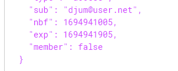
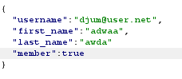
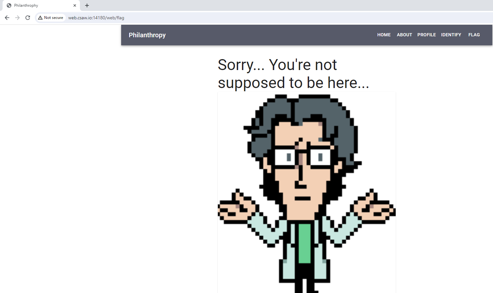
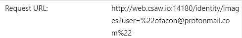
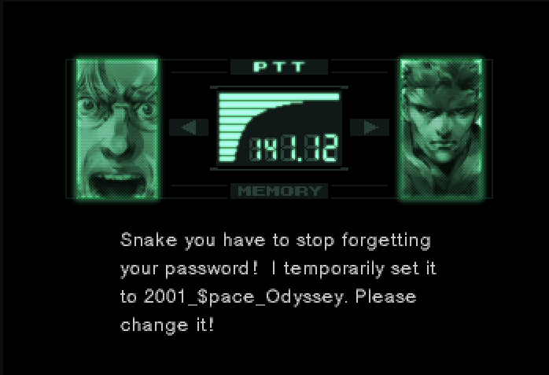
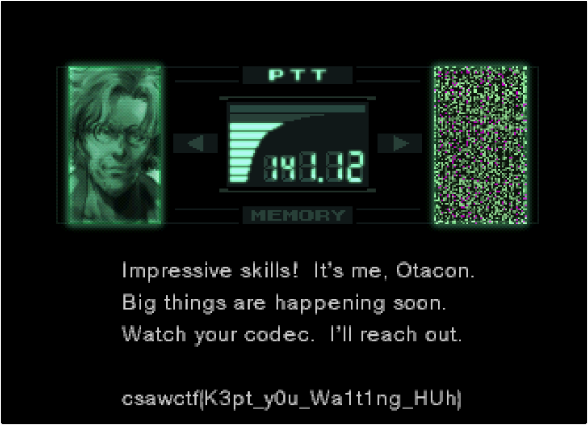

# Philantrophy

Given a website where we able to login, create user, and few other functionality

After creating a user and login, we can access  profile, and ugrade page where we need to give membership code.

In the jwt cookie, we can see that there's a member key with false value.

We can modify this value by abusing the identity/update endpoint by adding the key member as true, this called mass assignment bug.

but when we access the flag section, we get this image

In the identify page, we need to answer if the image is a refference of Metal Gear Solid. Kinda stuck for a moment, but then I see from the network that it made a reqeust to this endpoint:

SO i follow the url and it give a response message of images with credits and submitter from the users, one of them is solidsnake@protonmail.com. so we change the paramter from the url to that email and we given an image name: "b6116d5a-a415-4438-8f43-2b4cb648593e.png"

Using the image loader endpoint: http://web.csaw.io:14180/images/{image}

we can acces that image which show us the secret images

looks like it was a credential. Now if we login using solidsnake@protonmail.com with it's credential and access the flag page, we get the flag:

 

<h3>Flag: <i>csawstc{K3pt_y0u_Wa1t1ng_HUh}</i></h3>

